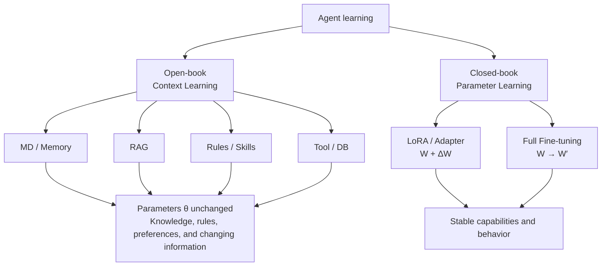
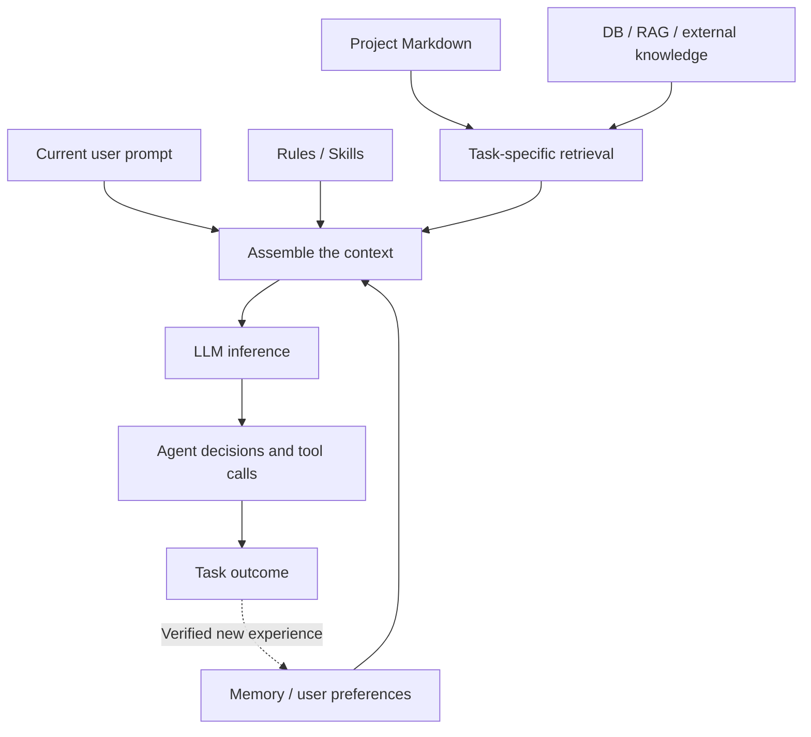
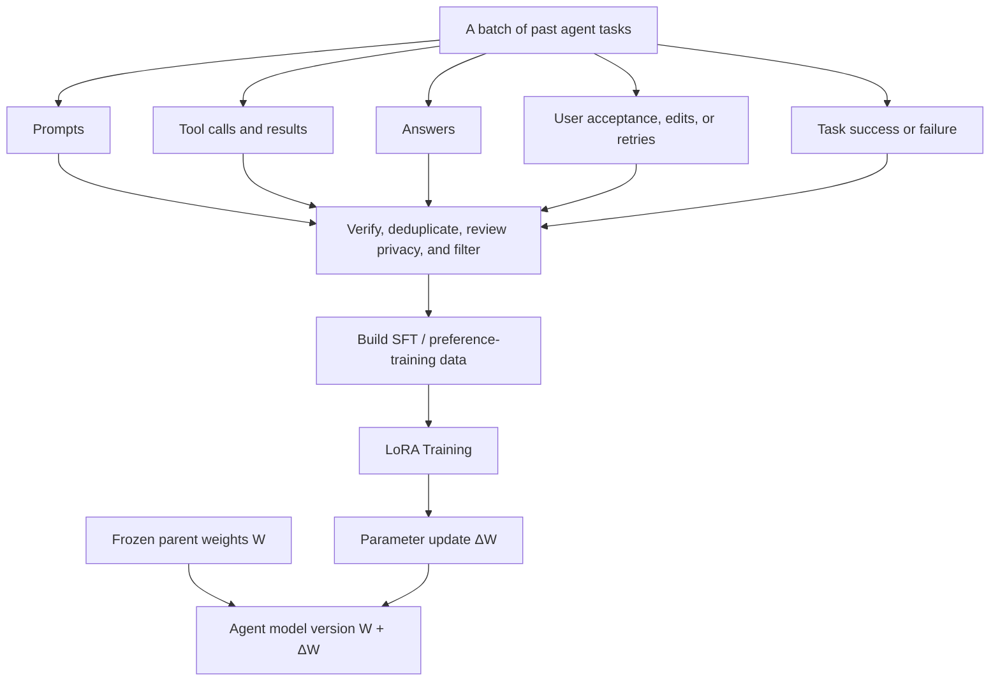
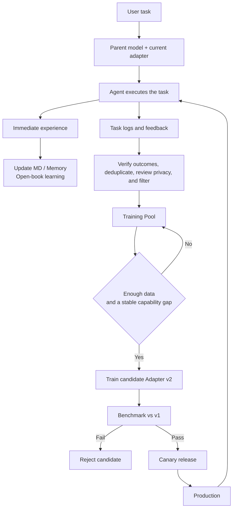
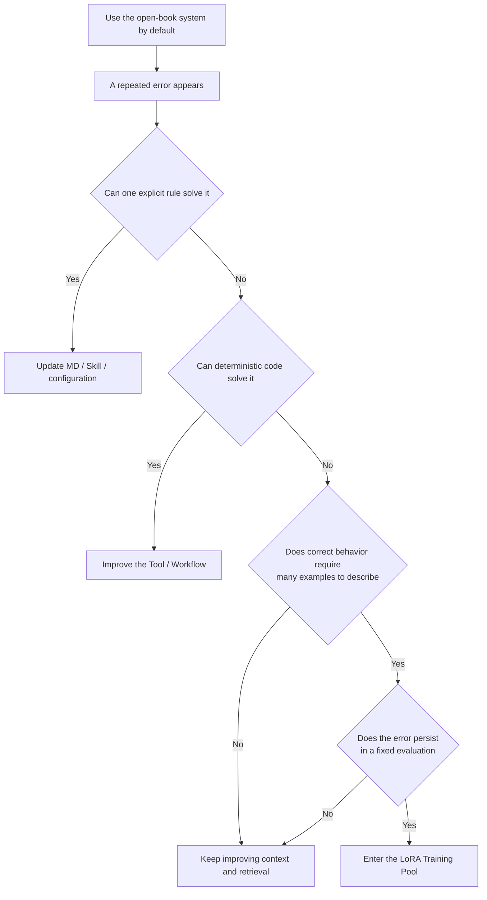

# Can an Agent Really Learn? From a Markdown File to a LoRA Adapter

[中文版](README.md)

I keep returning to a simple question. When we say that an agent gets to know its user over time, what exactly has learned?

Suppose a user repeatedly asks the agent to show a diff before editing a file. The agent can save that preference in `USER_PREFERENCE.md` and load it before the next task. Its behavior changes, but the model parameters do not.

Does that count as learning?

At the system level, yes. At the model-training level, the model has merely received another piece of reading material. I use two deliberately informal names to keep these cases apart.



## The open-book Markdown approach

Before a task, the agent loads the user's preferences, project rules, relevant memories, and current request into the context window. The material may come from Markdown files, a database, RAG, a knowledge graph, or a skill. Markdown is simply the easiest version to inspect.

```text
User task
  +
USER_PREFERENCE.md
  +
PROJECT_RULES.md
  +
Relevant memories or retrieved documents
  ↓
LLM
```

Expanded into its working parts, the path looks like this.



If the model parameters are denoted by $\theta$, then

$$
\theta_{t+1}=\theta_t
$$

The model has not changed. It walks into each exam carrying the right notes.

This approach works well for user preferences, project conventions, explicit policies, and changing knowledge. If a company changes its report format, we edit a file. Retraining a model for that would be wasteful.

A growing context window is not, by itself, a reason to fine-tune. We can retrieve only the relevant passages, compress old memories, and move deterministic steps into tools or workflows. Many apparent capability failures are retrieval or orchestration failures in disguise.

## The closed-book periodic LoRA approach

The second approach changes parameterized behavior.

An agent can retain task trajectories containing prompts, tool calls, final answers, user edits, and verified outcomes. After careful filtering, those records can support supervised fine-tuning, preference optimization, or another post-training method. LoRA is one practical option.



For a model weight matrix $W$, LoRA freezes the original weights and learns two smaller low-rank matrices, $A$ and $B$. A common expression is

$$
W'=W+\frac{\alpha}{r}BA
$$

The base weights remain intact while the adapter supplies a learned update. The model may now behave differently even when the old lesson is absent from the prompt. In that sense, the lesson has moved into parameters.

I like to think of the base model as the parent model, with versioned adapters stored beside it.

```text
Qwen Base
  ├── No adapter
  ├── agent-v1
  ├── agent-v2
  └── agent-v3
```

Keeping the base checkpoint and older adapters makes switching and rollback straightforward. It also makes LoRA attractive for low-cost, isolated experiments.

Rollback does not make an adapter inherently safe. It can still overfit, reinforce bad examples, or degrade an older capability. Full fine-tuning can also be rolled back when the original checkpoint has been preserved. The dangerous setup is the one with no versioned checkpoint, no evaluation, and no recovery path.

## Logs are raw material, not a training set

A user accepting an answer is a weak signal. They may simply be tired of revising it. A retry does not prove that the previous answer was entirely wrong.

Agent logs therefore need outcome verification, deduplication, privacy review, and quality filtering before they become training data. High-stakes domains such as medicine and finance also require qualified human review. Letting a model grade its own output and immediately train on that grade is an efficient way to preserve mistakes.



Training should not start merely because the system has collected ten thousand prompts. It needs enough high-quality data and evidence of a stable, repeated capability gap. Without both conditions, post-training mostly teaches the model about noise.

## Online and periodic describe timing

Online learning does not need to be a third category in this framework. Online and periodic describe when an update happens. Markdown, LoRA, and full fine-tuning describe how it happens.

Memory can be updated immediately or consolidated periodically. Parameter updates can also occur continuously or in batches. Updating weights after every agent task is theoretically possible, but difficult to control. Bad feedback, shifting data, and catastrophic forgetting can accumulate quickly.

An asynchronous pipeline is easier to reason about. The production model keeps serving users while a candidate adapter trains in the background. The candidate faces the same benchmark as the current version, followed by a small canary release. Failed candidates are discarded, and production can return to an earlier adapter.

## Keep knowledge open-book and train stable capabilities carefully

The decision cannot be reduced to everyday work using Markdown while medicine and finance use LoRA.

A transaction threshold that requires a second confirmation is an explicit rule. It belongs in a policy engine or external configuration. Regulations, drug information, and market prices change. They belong in retrieval systems, databases, and tools rather than solely in model parameters.

LoRA is a better candidate for stable behavioral patterns that require many examples to describe. Imagine a model that repeatedly answers questions about local files from memory even though it should search them. The prompt is clear, the workflow has been checked, and the same failure remains visible in a fixed evaluation set. That is a capability gap worth considering for post-training.

Medical and financial systems demand stricter validation, auditability, and human oversight. Higher stakes make casual adapter updates less acceptable. Trained capability, current knowledge, deterministic policy, and calculation tools need to work together.

## My decision rule

I start with the simplest test. Can one clear rule solve the problem? If it can, the rule goes into Markdown, a skill, or configuration. When the material grows, retrieval limits what enters the prompt. Deterministic work moves into tools and workflows.



Only a stable failure that survives those changes becomes a LoRA candidate. It also needs enough reviewed examples to describe the desired behavior. A candidate adapter reaches production only after it beats the current version on fixed capability and safety evaluations.

The open-book system learns quickly because an edited document can affect the next task. The closed-book system learns slowly because it requires evidence, training, evaluation, and deployment. One follows change. The other develops stable behavioral habits.

That gives me two practical routes for agent learning. Keep knowledge, rules, and preferences outside the model and retrieve them when needed. Move repeated and hard-to-specify capability gaps toward parameter learning only after they have been verified.

An agent that respects this boundary is less likely to carve every accidental success and failure into its future behavior.
