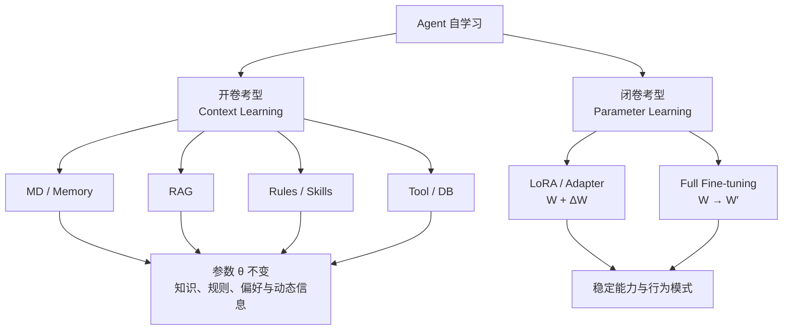
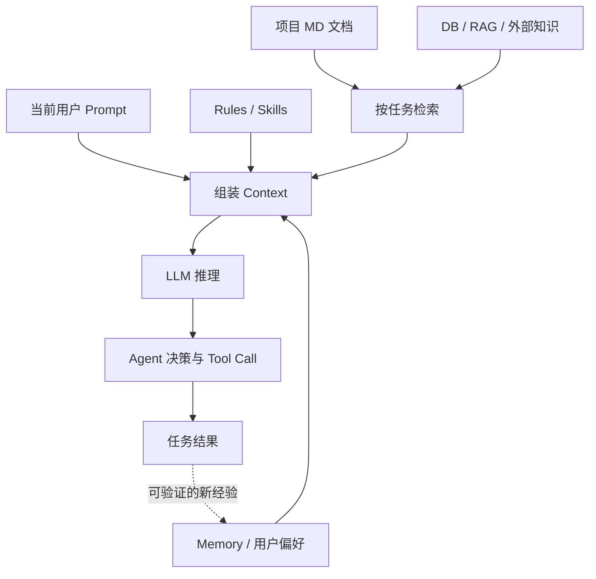
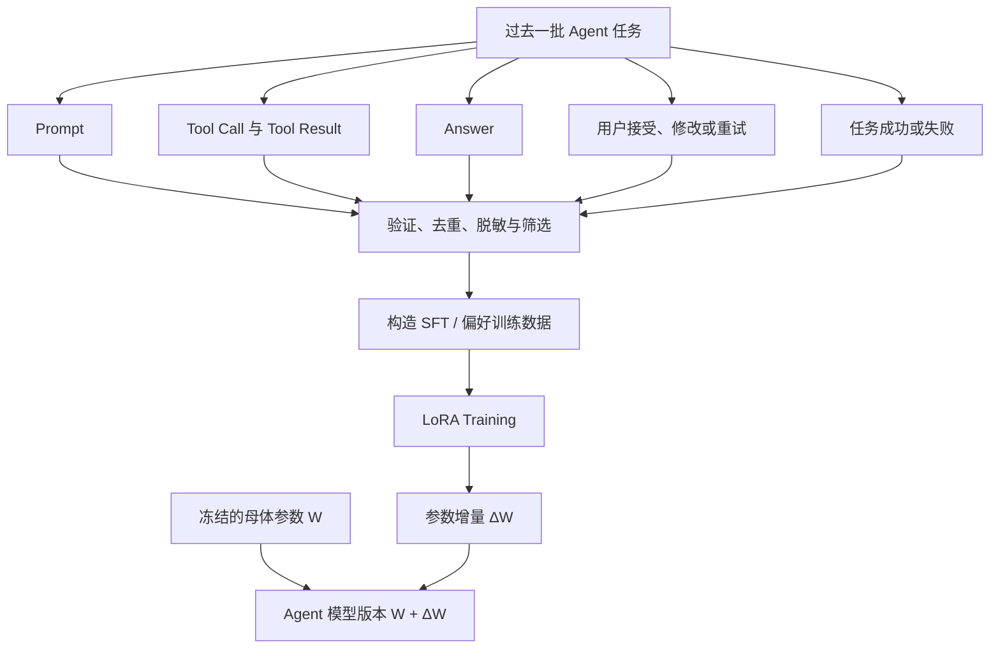
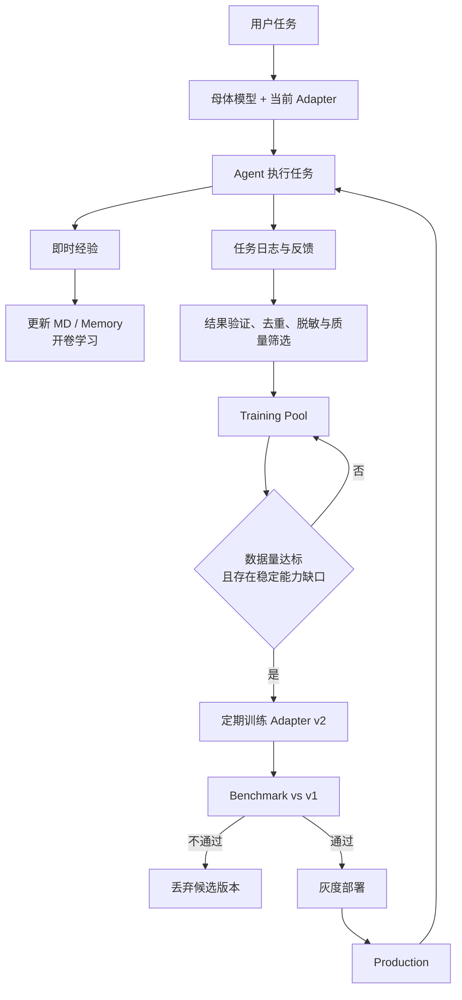
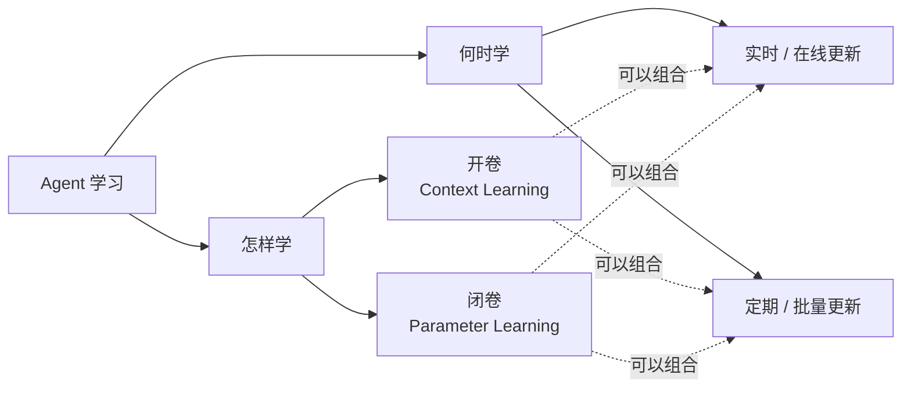
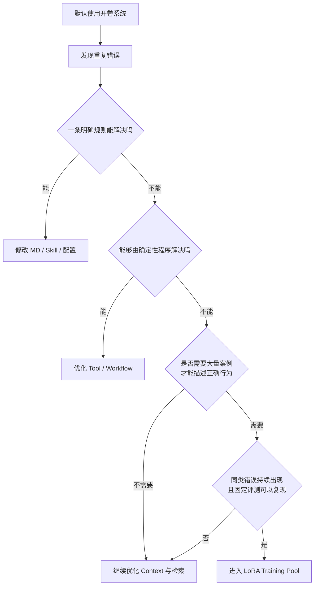

# Agent 真的会学习吗？从一份 MD 到一个 LoRA Adapter

[English](README.en.md)

我最近一直在想一个问题。我们说一个 Agent 用久了会越来越懂用户，它到底学了什么？

举个很普通的例子。用户反复要求改文件以前先展示 diff。Agent 可以把这句话写进 `USER_PREFERENCE.md`，以后每次执行任务都读一遍。它的表现确实变了，可模型参数从头到尾没有动过。

那还算学习吗？

从 Agent 系统的角度看，当然算。从模型训练的角度看，这只是给模型多带了一份材料。为了把这两件事分清楚，我想用两个很朴素的名字。

先想一场开卷考试。考生脑子里可以没有背下那条知识，只要进考场时带对了资料。数学考试带公式表，项目任务带 `PROJECT_RULES.md`，用户偏好藏在 `USER_PREFERENCE.md` 里。题目发下来，现场翻，照着做。下课铃一响，书合上，考生的脑子并没有因此多长一块。

这就是我说的开卷考型。每次 Agent 接到任务，都替模型准备一张与这道题对应的 cheat sheet。MD、Memory、RAG 和 Skill 都可以往这张纸上写。模型参数没动，换一张纸，它马上又能按另一套要求做事。

闭卷考就麻烦一点。资料不能带进去，平时练过的东西得留在脑子里。放到模型上，就是把反复出现的经验训练进参数。下次再碰到同类任务，即使 Agent 没把那份旧经验重新塞进 Prompt，模型也更可能知道该怎么做。

闭卷也得看题。当前任务仍然会作为 Prompt 交给模型，就像老师总要先发试卷。少掉的是参考答案和往年笔记，不是这次要解决的问题。



## 开卷考 MD 型

开卷这边主要是在替每场考试找资料。模型不用背住用户偏好和项目规则，Agent 在开考前把相关内容找出来，放进上下文就行。

Agent 在运行前，把用户偏好、项目规则、历史经验和当前任务一起放进上下文。材料可以存在 Markdown 里，也可以来自数据库、RAG、知识图谱或某个 Skill。MD 只是最容易看懂的一种载体。

```text
用户任务
  +
USER_PREFERENCE.md
  +
PROJECT_RULES.md
  +
相关记忆或检索结果
  ↓
LLM
```

把这条路径完整展开，大概是下面这样。



如果模型参数记作 $\theta$，整个过程里都有

$$
\theta_{t+1}=\theta_t
$$

模型的大脑没有改。它只是每次考试都带着材料，遇到问题就现场翻。

这种办法很适合用户偏好、项目约定和经常变化的知识。公司规定报告用什么格式，某个接口调用前要做什么检查，用户希望先看 diff，这些都能明确写出来。规则有变化，改文件就行，不必重新训练模型。

上下文太长时，也不该立刻去训练。我们可以先按任务检索相关段落，压缩旧记忆，把确定的步骤交给程序或工具。很多所谓的能力问题，最后查出来只是材料没找对，或者工作流没接好。

## 闭卷考参数型

闭卷这边要做的是训练。模型做过一批题，哪些地方答对了，哪些地方总犯同一个毛病，先收集起来，再把值得保留的经验练进参数。LoRA 是一种很适合 Agent 版本管理的练法。

Agent 做过大量任务以后，我们把执行记录保存下来。里面可能有用户任务、工具调用、最终回答、用户修改和任务结果。经过筛选，这些记录可以变成训练数据，再通过监督微调，也就是 SFT，或偏好优化等后训练方法训练一个 LoRA Adapter。下文为了方便，会把原始基础模型叫作母体模型。



LoRA 会冻结基础模型的原始权重。假设某一层的权重矩阵是 $W$，它学习两个较小的低秩矩阵 $A$ 和 $B$。使用 Adapter 时，这一层可以写成

$$
W'=W+\frac{\alpha}{r}BA
$$

直觉上看，原来的 $W$ 还在旁边安静待着，Adapter 提供了一份参数增量。下一次模型没有在 Prompt 里读到那条经验，行为仍然可能发生变化。经验已经进了参数。

不同版本的 Adapter 可以放在母体模型旁边。

```text
Qwen Base
  ├── 不加载 Adapter
  ├── 加载 agent-v1
  ├── 加载 agent-v2
  └── 加载 agent-v3
```

只要母体模型和旧 Adapter 都保留着，切换版本很方便。新版本评测失败，重新加载旧 Adapter 即可。LoRA 因此很适合做隔离、版本管理和低成本实验。

方便回滚不代表结果天然安全。Adapter 仍然会学进错误，可能过拟合，也可能让旧能力退化。全量微调同样可以回滚，前提是原始 checkpoint 还在。真正麻烦的情况，是覆盖了唯一的模型文件，又没有留下任何版本记录。

闭卷学习也可以直接更新母体参数，这就是全量微调。LoRA 学的是外挂在母体旁边的增量，全量微调得到的则是一套新的母体权重。两者都属于参数学习，区别在于更新范围、训练成本和版本隔离方式。

## 任务日志不能直接拿去训练

用户点了接受，不一定说明答案很好。他可能只是懒得继续改。一次重试也不能证明前面的回答毫无价值。

所以任务日志只能算原料。比较稳妥的做法是先验证任务结果，再去重、脱敏和筛选。医疗、金融等高风险数据还需要领域专家参与，不能让模型给自己的答案打个高分，随后拿回去训练自己。



触发训练也不该只看 Prompt 数量。积累一万个任务，里面没有稳定且重复的能力缺口，训练只会把噪声搬进参数。数据量达到门槛，同时评测确认旧模型确实在某类任务上反复失败，这时训练才有明确目标。

## 学习方式确定以后，还要决定何时更新

讲到这里，我们只回答了一个问题。Agent 用什么方式学习？开卷系统修改参数外的材料，闭卷系统训练模型参数。

工程上还有另一个问题。Agent 在什么时候更新？它可以收到新经验就处理，也可以先积累一批，再统一处理。前者通常叫实时或在线更新，后者可以叫定期或批量更新。



这样就不会冒出第三种学习原理。在线和定期属于时间安排，可以与两种学习方式分别组合。我们可以实时更新记忆，也可以定期整理 MD。参数训练同样可以每来一批数据就做，也可以攒够数据以后再做。

Agent 执行一个任务就立刻梯度下降一次，工程风险通常很高。错误反馈、数据分布变化和灾难性遗忘都会让系统越来越难控制。

我更喜欢异步的慢更新。线上版本继续服务，后台训练候选 Adapter。新版本先和生产版本跑同一套评测，再从少量流量开始验证。指标不对就停下来，生产环境仍然可以切回旧版本。

## 知识留在开卷系统，能力再考虑闭卷

这两个办法的边界不能简单画成日常任务用 MD，医疗金融用 LoRA。

金融系统规定单笔交易达到某个金额需要二次确认。这是一条明确规则，应该交给规则引擎和外部配置。监管政策、药品信息和市场价格一直在变，也应该通过数据库、检索或工具获得。把它们只记进参数，训练结束那天就可能已经过时。

LoRA 更适合稳定、重复、需要大量案例才能描述的行为模式。比如模型反复在该搜索本地文件时直接凭记忆回答，Prompt 已经写清楚，工作流也检查过，同类错误仍在固定评测里出现。这样的能力缺口才值得进入训练样本池。

医疗和金融的模型更新还需要更严的验证、审计和人工监督。领域风险越高，越不能把 LoRA 当成补丁到处贴。专业能力、最新知识、确定性规则和计算工具要一起工作，各自负责自己擅长的部分。

## 我会怎样决定

我的默认顺序很简单。



先看能否用一条清楚的规则解决。能解决，就写进 MD、Skill 或配置。规则很多时按任务检索，只加载眼前需要的部分。能够由程序确定完成的事情交给 Tool 或 Workflow。

这些办法都试过以后，如果同一种错误仍然稳定出现，并且大量高质量案例能描述正确行为，再把它放进 LoRA 训练池。候选 Adapter 只有在固定评测和安全指标上超过生产版本，才有资格上线。

开卷系统学得快，改完材料下一次任务就能用。闭卷系统学得慢，它要收集证据、训练、评测和发布。一个负责跟上变化，一个负责练出稳定的行为习惯。

我现在愿意把 Agent 学习归纳成这两条路。知识、规则和偏好放在参数外面，按需取用。反复出现、难以写成规则的能力缺口，经过验证以后再进入参数。能用上下文解决的先不训练，能用确定性程序解决的也不训练。

这条边界守住了，一个会学习的 Agent 才不至于把每次偶然的成功和失败都刻进自己身上。
