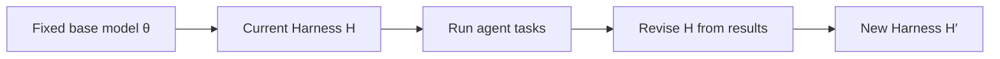
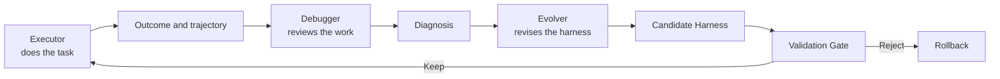
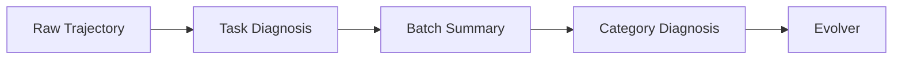
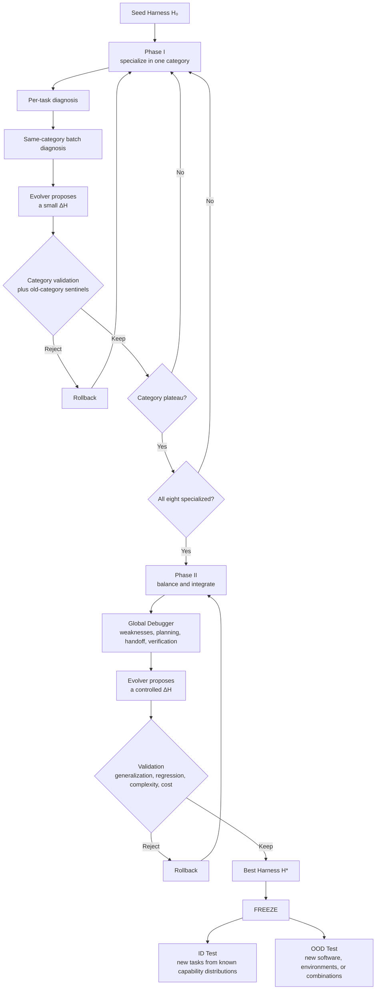
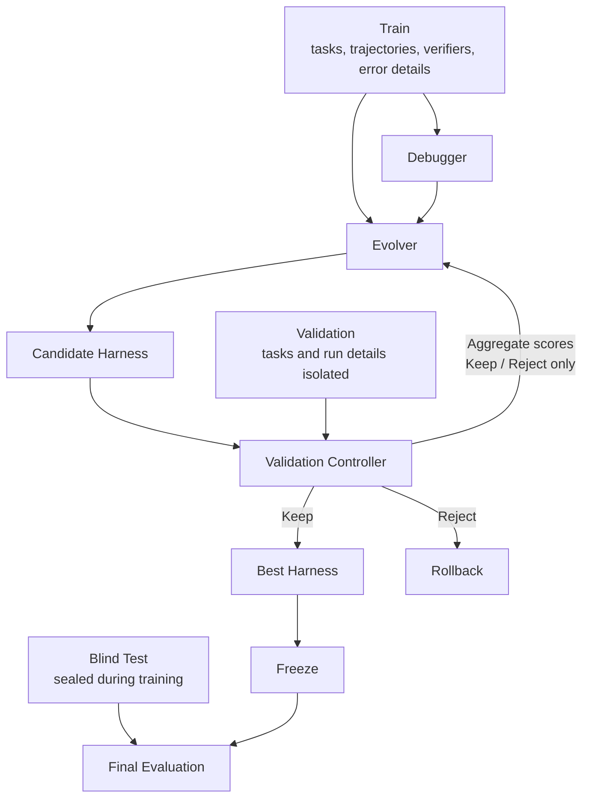

# Can an Agent Improve How It Studies After the Exam?

[中文版](README.md)

After finishing the first lesson on how agents learn, I was left with another question.

We send an agent into a benchmark. It receives a task, opens a terminal, calls tools, bumps into a few errors, and eventually submits its work. A verifier inspects the final environment and returns PASS or FAIL. After a few dozen tasks, the leaderboard has a new score and the experiment folder has a new pile of logs.

Then what?

The next time a similar task appears, the agent may walk down the same wrong path again. Its commands, errors, and tool calls are all sitting in the logs like a marked exam paper nobody plans to reopen. The score tells us how the agent performed. It does not improve the agent's study habits.

I recently read [Agentic Harness Engineering](https://github.com/china-qijizhifeng/agentic-harness-engineering/blob/main/README_zh.md) and liked one of its central ideas. The base model can remain fixed while the harness around it evolves. System prompts, tool descriptions, tool implementations, middleware, skills, sub-agents, and long-term memory can all be revised from execution records, with Git tracking and rollback along the way.

That led me to a new question.

> After reviewing its mistakes, can an agent revise its own notes, tools, and problem-solving routine?

In Lesson 1, open-book learning placed Markdown, memory, and RAG in the context, while closed-book learning changed model parameters through post-training. This lesson still concerns learning, but the student is different. We will leave the model weights alone and train the harness around them.

The discussion has three parts.

```text
Part 1
Why a harness can be trained

Part 2
How the training process could work

Part 3
How to tell whether it learned without learning bad habits
```

## Part 1: Why a harness can be trained

### What is a harness?

In an agent system, the harness is the collection of machinery that turns a language model into an agent.

```text
LLM
├── System Prompt
├── Skills
├── Tools and tool descriptions
├── Memory
├── Middleware and workflows
├── Sub-agents
└── Runtime rules
```

The same model can behave very differently under two harnesses. One may tell it to read project rules before editing a file, inspect exit codes after commands, and check logs after a failure. Another may hand it a shell and wish it luck.

We usually treat these components as engineering artifacts written by people. AHE suggests another view. They can also form a set of parameters that a system searches, modifies, compares, and rolls back.

Let the current harness be

$$
H=\{P,S,T,M,W,A,\ldots\}
$$

Here, $P$ denotes prompts, $S$ skills, $T$ tools, $M$ memory, $W$ middleware or workflows, and $A$ sub-agents.

Neural-network parameters are numerical values. Harness parameters may be natural language, YAML, Python code, or routing rules. Humans can read them and machines can execute them. I will call this a `Semantic Parameter Space`.

Closed-book training in Lesson 1 changed the model weights $\theta$. This time, we fix $\theta$ and modify $H$.



The model stays put. Its notes, tools, and working routine change around it.

### Markdown has no gradient, so how can it be trained?

Model training has a loss function and backpropagation. A `skill.md` file is less cooperative. It will not reveal its partial derivatives.

This line does not become valid just because it looks determined.

```text
debugging.md -= 0.001 × gradient
```

Harness training therefore takes another route.

```text
Run tasks
→ collect outcomes and full trajectories
→ diagnose failures
→ revise the harness
→ evaluate on independent tasks
→ keep or roll back
```

This resembles black-box optimization. We can observe how well a harness performs and inspect what happened during execution, but no numerical gradient points to line 37 of `shell_skill.md`.

The objective can still be written as

$$
H^*=\arg\max_H J(H)
$$

$J(H)$ measures how well a harness performs on the task distribution. Training is possible because we have something editable, observable feedback, an update procedure, and an independent selection rule. A missing gradient does not make the optimization problem disappear.

A FAIL result contains only one bit of information. It says the task failed, but it does not explain whether the agent chose the wrong tool, ignored an error, or declared victory one command too early. Someone still has to review the paper.

### Three roles make a small agent tutoring school

We can begin with three roles. The Executor takes the exam, the Debugger reviews the work, and the Evolver changes the study method.

Everything between receiving a task and submitting the result forms an execution trajectory. It includes dialogue, tool calls, observations, and errors. Think of it as an exam paper covered with working notes. That is what the Debugger needs to read.



#### The Executor takes the exam

The Executor is the agent being trained. It receives a task and the current harness, calls tools, and attempts to complete the job.

The same task should usually receive more than one rollout. Agent behavior is stochastic. A harness may succeed three times and fail twice. One run can easily mistake luck for ability.

If task $i$ runs $k$ times and $r_{ij}$ is 1 for success and 0 for failure, its observed success rate is

$$
p_i=\frac{1}{k}\sum_{j=1}^{k}r_{ij}
$$

The training record should contain much more than $3/5$. It should preserve the task, conversation, tool calls, observations, errors, terminal output, final state, verifier result, token use, step count, and runtime.

Terminal-Bench verifiers are useful here because they primarily inspect whether the final environment satisfies the task. An agent may take a different route from the reference solution and stumble along the way. If it repairs the environment correctly, it can still pass. We care about solving the task, not memorizing an official sequence of commands.

#### The Debugger reviews the paper

The Debugger compares multiple successful and failed rollouts of the same task.

Suppose successful attempts check the exit code after a critical command and then verify the target state. Failed attempts continue immediately, letting one unnoticed error travel to the end. The diagnosis can then identify a repeated defect, the likely harness component, and a proposed direction for repair.

Some researchers describe this diagnosis as a `semantic gradient`. The analogy is useful as long as we respect its limits. It is not a computable gradient. It only suggests a promising semantic direction for the Evolver.

#### The Evolver revises the study method

The Evolver reads the current harness and the diagnosis, then proposes a candidate change.

It may add a skill or revise a tool description. Later it must also delete, merge, and split components. An Evolver that only knows ADD will soon produce a huge collection of sensible reminders in which nothing important can be found.

Every change should retain its evidence. Which failures triggered it? What root cause did the Debugger infer? Which component changed? Which tasks should improve, and which capabilities might regress? Store that record with the harness in Git so a bad version can be rolled back.

One training round can be written in three steps.

$$
\tau_t=\mathrm{Executor}(H_t,D_{train})
$$

$$
d_t=\mathrm{Debugger}(\tau_t,R_t)
$$

$$
H_{t+1}=\mathrm{Evolver}(H_t,d_t)
$$

| Machine Learning | Harness Training |
| --- | --- |
| Model parameters $\theta$ | Semantic parameters $H$ |
| Training sample | Agent task |
| Forward pass | Agent rollout |
| Label or test result | Verifier |
| Loss signal | PASS / FAIL plus trajectory |
| Gradient | Debugger diagnosis |
| Optimizer | Evolver |
| Parameter update | ADD / MODIFY / DELETE / MERGE / SPLIT |
| Epoch | One round or batch of harness evolution |
| Checkpoint | Harness Git snapshot |
| Early stopping | Validation stops improving |

## Part 2: How the training process could work

### Practice individual subjects before the combined exam

Giving the Debugger every task at once sounds comprehensive and quickly becomes confusing. A young agent may not even check whether a shell command worked. Mixing hundreds of networking, database, and workflow trajectories at that point can make a basic execution problem look like a grand coordination failure.

I would split training into two phases.

#### Phase I builds the fundamentals

For an initial seminar experiment, we can use eight working categories.

| Category | Rough focus |
| --- | --- |
| System | Services, processes, permissions, and system configuration |
| Coding | Understanding, modifying, running, and testing code |
| Network | Ports, connections, protocols, and network diagnosis |
| Filesystem | Paths, permissions, file operations, and content checks |
| Package / Environment | Dependencies, package managers, environment variables, and runtimes |
| Database | Connections, queries, migrations, and state verification |
| Data Processing | Reading, cleaning, transforming, and writing data |
| Complex Tasks | Multi-step tasks that cross several components |

These are working categories inspired by the task shapes visible in [Terminal-Bench 2.0](https://www.tbench.ai/leaderboard/terminal-bench/2.0). They are not an official Terminal-Bench taxonomy. A real dataset would need explicit inclusion rules for each category.

Phase I uses two levels of diagnosis. Per-task diagnosis compares several rollouts of one task. Same-category batch diagnosis then searches across related tasks for a shared failure pattern. The second level should teach a general working habit, not write an nginx answer into a skill file.

Long trajectories can be compressed in layers.



Every summary must remain traceable to its original evidence. Otherwise the last stage receives a polished sentence such as “the agent needs stronger verification awareness” and has no idea what to edit.

My current hypothesis is to treat Phase I as subject specialization. Select one category and train it with both Debuggers until it reaches a minimum capability threshold and then a plateau. Move to the next category and repeat until all eight have received focused practice.

Within one iteration, sample a small batch from the current category and run each task once or twice. Set aside tasks with stable outcomes. Add rollouts for uncertain tasks and failures that expose an important defect. This preserves evidence without stuffing every trajectory into every Debugger context.

If category $c$ has validation score $S_c^{(t)}$ at round $t$, a plateau rule can check whether its recent improvement stays below $\epsilon$ for several rounds.

The harness may still be shared across categories. A database change can damage a system skill trained earlier. Before accepting a specialist update, run a small sentinel set from previously trained categories. These sentinels do not balance all eight subjects during Phase I. They catch obvious forgetting.

The category order, whether all categories should share one harness, and the exact plateau rule remain open research choices. This two-phase curriculum is a proposal to test, not a law of agent learning.

#### Phase II tries to keep all eight bowls level

After every category reaches its specialist plateau, training moves to the global phase. A useful balancing objective is

$$
\max_H\min_c S_c(H)
$$

The weakest category receives more attention. If System scores 92 and Coding 90 while Database sits at 51 and Complex Tasks at 47, a strong overall average hides a very lopsided student.

The Debugger must also examine cross-category work. A complex task may read logs, clean data, write to a database, start a service, and verify an API. Each isolated skill can work while the combined task fails because paths, parameters, or state are lost between steps.

Phase II therefore focuses on planning, context handoff, tool switching, state tracking, termination, and global verification. Passing four separate exercises does not guarantee that the agent can solve one problem containing all four.



### Train, validation, and test each guard a different door

Harness evolution repeatedly reads tasks, studies trajectories, and revises rules. Once it has multiple iterations resembling epochs, it can overfit.

Suppose we begin with 50 tasks per category, 400 in total. A reasonable discussion point is 80% Train, 10% Validation, and 10% Blind Test. The exact ratio may change with dataset size, but the responsibilities must remain separate.

| Split | Per category | Total | Purpose |
| --- | --- | --- | --- |
| Train | 40 | 320 | Repeated execution, diagnosis, and harness revision |
| Validation | 5 | 40 | Version selection, overfitting checks, and stopping |
| Blind Test | 5 | 40 | Final generalization evaluation after freezing |

The split must also respect task families. All variants from one family stay together.

A deterministic Validation Controller can run evaluations, aggregate scores, and apply a predefined Keep or Reject rule. The Evolver learns whether the candidate passed but cannot inspect the validation tasks.



Train trajectories teach the system where to change. Validation chooses versions and enables early stopping without revealing task prompts, trajectories, verifiers, or error details to the Debugger and Evolver. If those agents can inspect why a validation task failed, validation has quietly joined the training set.

Keep decisions also need protection from random variation. A 0.3-point gain may be a lucky batch. Near a plateau, smaller improvements can be accepted, but they need stronger evidence from repeated rollouts, another validation batch, or confidence intervals. The smaller the gain, the more evidence it should require.

The Blind Test remains sealed throughout development. After selecting and freezing the best harness, open it for the first final evaluation. If the result drives another revision, that test set has become a validation set with a more expensive name.

#### K-fold as a seminar extension

With limited data, Stratified Group K-Fold can estimate whether the training algorithm is stable. Stratification keeps category proportions similar. Grouping keeps a task family inside one fold. Every fold must restart from the same seed harness instead of inheriting the harness evolved in the previous fold.

Full evolution in every fold is expensive, so an MVP can begin with a fixed Train, Validation, and Blind Test split. K-Fold reports the mean and variation of validation improvement across splits. It does not replace the final blind test.

### Changing the software name is not enough

If most training tasks concern shell and file operations, the Evolver will become excellent at pleasing those tasks. Database and networking ability may remain two electives the agent never attended.

Categories should therefore contain similar numbers of tasks, and the primary score should use macro-averaged category accuracy.

$$
\text{MacroAccuracy}=\frac{1}{C}\sum_{c=1}^{C}S_c
$$

Balanced counts solve only half the problem. We must also prevent leakage.

Changing “repair nginx configuration” into “repair Apache configuration” may leave the failure mode, verifier, and solution path almost identical. A test set full of such cousins gives a flattering picture of generalization.

One capability should contain genuinely different task templates. Service diagnosis might cover port conflicts, permission errors, environment mistakes, missing dependencies, systemd configuration, and socket failures. They share a higher-level routine of diagnosis, hypothesis, inspection, repair, and verification while requiring different concrete paths.

Tasks with related templates, shared environments, or derived verifiers belong to one Task Family. Move the whole group into Train, Validation, or Test. Do not place nginx in Train and its Apache costume change in Test.

The final evaluation can contain two views. ID Test uses unseen task families from familiar capability distributions. OOD Test introduces new software, environments, or task combinations.

## Part 3: How to tell whether it learned without learning bad habits

### An agent cannot earn progress by adding rules forever

The easiest action for an Evolver is ADD. One failure produces one rule, and the next failure produces another. Accuracy may rise while the harness grows into an ancestral document nobody dares to clean.

#### Change one thing at a time

Early training should prefer atomic updates. Change one skill, one tool, or one logical block of a prompt. When validation moves, we still have a chance of knowing who deserves the credit.

An impact budget can measure the scope of a proposed $\Delta H$.

$$
I(\Delta H)=\alpha N_f+\beta N_c+\gamma T_\Delta+\delta R_s
$$

$N_f$ counts files, $N_c$ components, $T_\Delta$ token change, and $R_s$ semantic reach. A local skill edit and a rewrite of the global system prompt should not cost the same.

Two thresholds deserve separate names. `Modification Budget` limits how much one update may change. It should tighten as the agent matures. `Minimum Accepted Gain` specifies how much improvement is enough. Near a plateau, smaller gains may matter, but the statistical evidence must become stronger.

#### Keep the harness at a healthy weight

If we optimize accuracy alone, the Evolver can keep adding rules, tools, and context. Complexity needs a price.

$$
C(H)=\alpha T_H+\beta N_S+\gamma N_T+\delta L_{ctx}+\eta E_{runtime}
$$

$T_H$ is total harness tokens, $N_S$ the number of skills, $N_T$ the number of tools, $L_{ctx}$ average loaded context, and $E_{runtime}$ extra execution overhead.

An eight-thousand-token addition for a 0.5% gain deserves scrutiny. The model may have to read an expanding employee handbook before every task, and the bill may complain before accuracy does.

After several rounds, pause additions and run consolidation. Merge duplicate skills, delete obsolete rules, and turn repeated local patches into a smaller general skill. Then rerun validation to check that the cleanup did not throw away something useful.

#### A higher average can hide a collapsing subject

Let the capability vector at round $t$ be

$$
\mathbf S_t=[S_1,S_2,\ldots,S_C]
$$

A candidate can improve macro accuracy while badly damaging one category. Add a per-category regression constraint.

$$
S_c^{(t+1)}-S_c^{(t)}\ge -\delta_c
$$

Harnesses can forget too. If a new skill changes tool selection, older tasks may regress. Store the historical best for each category and measure the distance from that best.

$$
F_t=\max_c\left(S_c^{best}-S_c^{(t)}\right)
$$

This catches the worst regression. An average forgetting measure detects many small declines.

$$
F_{avg}=\frac{1}{C}\sum_c\max\left(0,S_c^{best}-S_c^{(t)}\right)
$$

The exact thresholds need experiments. A candidate should still present more than a screenshot showing that the overall score went up.

### Do not call brute force intelligence

Running a task five times reduces noise. Running every training task five times in every round also burns through a budget quickly.

Batching and adaptive sampling are more practical. Stable successes and stable failures receive fewer runs. Uncertain tasks, representative failures, and tasks affected by the latest update receive more.

$$
k_i=f(\text{uncertainty}_i)
$$

The report should contain outcome metrics such as per-category accuracy, macro accuracy, ID, and OOD results. Process metrics should track tool calls, steps, tokens, runtime, invalid tool calls, retries, and error recovery.

These two systems can both improve from 68% to 76%.

```text
System A
Pass      68% → 76%
Tokens    35K → 22K

System B
Pass      68% → 76%
Tokens    35K → 190K
```

System A looks excellent. System B may simply have learned to keep trying every door. That can still be a useful result, but the claim must be rewritten after reading the bill.

### How do we show that the harness learned?

The main experiment should fix the base model, token budget, maximum steps, timeout, environment, and initial tool permissions. The only variable is the harness.

```text
Seed Harness
vs
Evolved Harness
```

Compare Train and Validation first. Then freeze the best version and evaluate it on ID and OOD tests.

Ablation asks where the improvement came from. Remove skill, tool, memory, middleware, and prompt changes in turn. If the entire gain comes from an ever-growing global prompt, the result tells a different story from a broadly improved harness.

Model transfer is another useful later experiment. Evolve a harness with one base model, freeze it, and run it with another. Improvement after the swap would suggest that the harness captured some transferable agent behavior.

The final objective should account for more than accuracy.

$$
H^*=\arg\max_H\left[J_{\text{generalization}}(H)-\lambda C(H)-\mu F(H)-\nu E(H)\right]
$$

$J_{\text{generalization}}$ measures generalization, $C(H)$ harness complexity, $F(H)$ forgetting and capability regression, and $E(H)$ execution cost in tokens, steps, and time.

The agent we want should solve tasks it has never seen. It should not grow eight thousand tokens of rules for half a point, and it should not forget the filesystem the moment it learns databases.

That leaves one direct research question.

> Can executable semantic parameters such as skills, tools, memory, prompts, and middleware be trained from task-level experience and carry their working methods to unseen tasks?

It is still a question. The answer will have to come from a carefully built dataset, a training algorithm, and a genuinely sealed test set.
