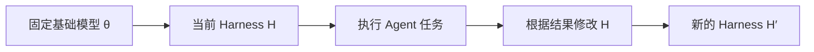
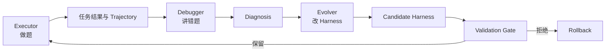
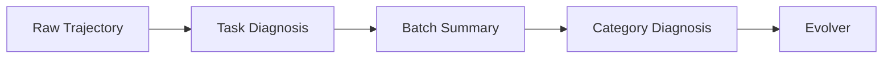
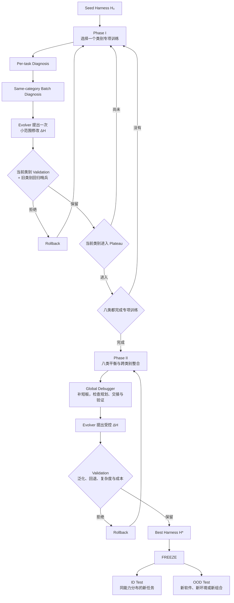
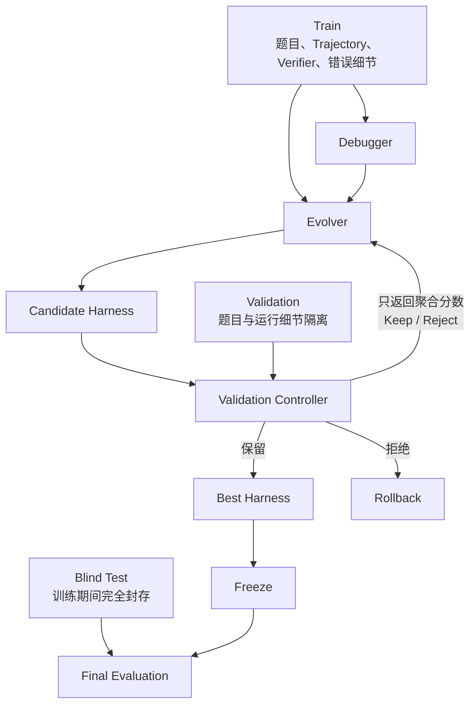

# Agent 考完试以后，能不能自己改进学习方法

[English](README.en.md)

第一课聊完 Agent 怎么学习，我脑子里还留着一个问题。

我们让 Agent 去跑一次 benchmark。它接到任务，打开终端，调用工具，中间撞上几个报错，好不容易把结果交上去。Verifier 看一眼最后的环境，给出 PASS 或 FAIL。几十道题跑完，排行榜上多了一个分数，实验目录里多了一堆日志。

然后呢？

下一轮再遇到类似任务，Agent 可能沿着同一条岔路再走一遍。上次失败时留下的命令、报错和工具调用都躺在日志里，像一本批改完却没人翻的错题本。分数告诉我们它考得怎么样，没有替它改掉做题习惯。

我最近读到 [Agentic Harness Engineering](https://github.com/china-qijizhifeng/agentic-harness-engineering/blob/main/README_zh.md)，很喜欢其中一个想法。基础模型可以保持不变，围在模型外面的 Harness 继续演化。系统提示词、工具说明、工具实现、中间件、Skill、子 Agent 和长期记忆都能根据执行记录被修改，还能用 Git 追踪和回滚。

这给了我一个新的问题。

> Agent 能不能看完自己的错题以后，自己修改资料、工具和做题方法？

第一课里，我们讨论了两种学习。开卷考把 MD、Memory 和 RAG 放进 Context，闭卷考通过后训练改变模型参数。这一课仍然在聊学习，只是把被训练的对象换了。模型参数先别动，我们来训练它周围的 Harness。

这节课分成三部分。第一部分先把 Harness Training 讲明白，第二部分组装训练算法，第三部分再给这套系统加上防作弊、防发胖和防偏科的护栏。

```text
第一部分
Harness 为什么也能训练

第二部分
这套训练具体怎样运行

第三部分
怎样证明它学会了，又没有学歪
```

## 第一部分　Harness 为什么也能训练

### Harness 到底是什么

Harness 这个词直译过来有点像马具。放到 Agent 里，它指的是那一整套把模型变成 Agent 的外部装置。

```text
LLM
├── System Prompt
├── Skills
├── Tools 与工具说明
├── Memory
├── Middleware 与 Workflow
├── Sub-agents
└── Runtime rules
```

同一个模型，给它不同的系统提示、工具和工作流，做事方式会差很多。一个 Harness 会提醒模型改文件前先读项目规则，执行命令后检查退出码，遇到失败先看日志。另一个 Harness 可能只给它一个 shell，然后祝它好运。

过去我们通常把这些东西当工程代码。人写好以后，Agent 照着运行。AHE 带来的启发是，我们也可以把它们看成一组能被搜索和修改的参数。

设当前 Harness 为

$$ H=(P,S,T,M,W,A,\ldots) $$

这里的 `P` 是 Prompt，`S` 是 Skills，`T` 是 Tools，`M` 是 Memory，`W` 是 Middleware 或 Workflow，`A` 是 Sub-agents。字母只是为了让后面的公式短一点，不需要把它们当成新的术语背下来。

神经网络的参数是一长串数值。Harness 的参数却可能是一段自然语言、一份 YAML、一段 Python 代码或一条路由规则。它们能被人读懂，也能直接执行。我愿意把这块叫作语义参数空间，也就是 `Semantic Parameter Space`。

第一课的闭卷训练修改模型权重 $\theta$。这一课固定 $\theta$，修改 $H$。



模型还是那个模型，周围的资料、工具和做题流程已经换了。把 Harness 叫作参数只解决了“改什么”，还没有回答“怎么改”。Markdown 文件不会像神经网络权重那样顺着梯度自己移动，这正是下一个麻烦。

### Markdown 没有梯度，怎么训练

模型训练有 loss，有反向传播。`skill.md` 比较倔，它不会告诉你自己的偏导数。

下面这行代码也不会因为写得很有气势就突然合法。

```text
debugging.md -= 0.001 × gradient
```

所以 Harness Training 走的是另一条路。

```text
执行任务
→ 收集结果和完整过程
→ 诊断为什么失败
→ 修改 Harness
→ 在独立任务上验证
→ 保留或回滚
```

它更像黑盒优化。我们知道某个 Harness 做完一批任务得了多少分，也能看到它中间做过什么，但没有一条数值梯度直接告诉我们该改 `shell_skill.md` 的第几行。

目标依然可以写成

$ H^*=\arg\max_H J(H) $

$J(H)$ 是当前 Harness 在任务上的表现。训练这件事能成立，因为这里有可修改的对象，有任务反馈，有修改方法，也有选择候选版本的标准。少了梯度，并不会让优化目标一起消失。

修改方向还得从执行过程里找。一个 FAIL 只有一比特信息。它能告诉我们这道题没做成，却不会主动交代是工具选错了、输出没检查，还是 Agent 在离成功一步之遥时提前宣布胜利。

我们得找个人讲卷子。

### 三个人组成一所 Agent 补习班

整个系统可以先抽成三个角色。Executor 负责做题，Debugger 负责讲错题，Evolver 负责改学习方法。

Agent 从收到任务到交出结果，中间留下的对话、工具调用、观察和报错合在一起，叫作一次执行轨迹，也就是 `trajectory`。它相当于写满草稿和修改痕迹的答题纸。Debugger 要看的正是这张纸。



#### Executor 负责考试

Executor 就是正在被训练的 Agent。给它一个任务和当前 Harness，它自己调用工具并完成任务。

同一道题最好允许跑几次。Agent 的输出带有随机性，同一个 Harness 可能三次成功、两次失败。只跑一次，很容易把手气当能力。

假设任务 $i$ 跑了 $k$ 次，每次结果记作 $r_{ij}$，其中成功为 1，失败为 0。这道题的成功率是

$$ p_i=\frac{1}{k}\sum_{j=1}^{k}r_{ij} $$

不过训练材料远比一个 $3/5$ 丰富。我们还要保存任务内容、完整对话、工具调用、观察结果、报错、终端输出、最终状态、Verifier 结果、Token、步数和运行时间。

Terminal-Bench 的 Verifier 很适合干这件事。它主要检查最终环境是否满足任务要求。Agent 可以走一条和参考方案不同的路，中间也可以摔一跤，只要最后把环境修对，仍然能通过。我们训练的是解决任务的能力，不要求 Agent 背标准步骤。

到这里，我们拿到了结果，也拿到了过程。可一份完整轨迹仍然只是案发现场，里面不会自动附上一张根因分析。Debugger 得从这些痕迹里找出真正反复发生的问题。

#### Debugger 负责讲错题

Debugger 拿到同一道题的多个 rollout，把成功和失败放在一起看。

比如成功的几次都有一个动作，执行命令后检查退出码，再验证目标状态。失败的几次执行完命令就继续往下走，错误从这一行一路传到最后。Debugger 这时可以给出一条有用的诊断。

```text
反复出现的缺陷
Agent 在关键修改后缺少状态验证

可能受影响的组件
Shell Skill 或 Tool feedback

建议方向
关键命令执行后检查退出状态和目标状态
验证失败时重新诊断
```

有人会把这种诊断叫作 `semantic gradient`。这个类比挺形象，边界也要守住。它没有给出一个可计算的梯度，只是告诉 Evolver，往哪个语义方向改更有希望。方向找到了，文件还没有动，真正落笔修改 Harness 的工作要交给 Evolver。

#### Evolver 负责改学习方法

Evolver 读当前 Harness 和 Debugger 的诊断，提出一个候选修改。

它能新增 Skill，也能修改工具说明。训练走到后面，它还得学会删除、合并和拆分。只会 ADD 的 Evolver 很快就能把 Harness 养成一个巨大的注意事项合集，每条看着都有道理，加载时谁也找不到重点。

每次修改都应该留下证据。哪几次失败触发了它，Debugger 判断的根因是什么，改了哪个组件，预期哪些任务会改善，又可能伤到哪些能力。这些内容连同 Harness 一起进入 Git，下一轮结果不对就能回滚。

如果喜欢用公式看过程，可以把一轮训练压成三步。Executor 先用当前 Harness $H_t$ 产生执行轨迹 $\tau_t$，Debugger 把轨迹和结果压成诊断 $d_t$，Evolver 再生成下一版 Harness。

$$ \tau_t=\mathrm{Executor}(H_t,D_{train}) $$

$$ d_t=\mathrm{Debugger}(\tau_t,R_t) $$

$$ H_{t+1}=\mathrm{Evolver}(H_t,d_t) $$

这和传统机器学习有一组很有意思的对应关系。

| 传统机器学习 | Harness Training |
| --- | --- |
| 模型参数 $\theta$ | 语义参数 $H$ |
| 训练样本 | Agent Task |
| Forward Pass | Agent Rollout |
| Label 或测试结果 | Verifier |
| Loss Signal | PASS / FAIL 加执行轨迹 |
| Gradient | Debugger 的语义诊断 |
| Optimizer | Evolver |
| Parameter Update | ADD / MODIFY / DELETE / MERGE / SPLIT |
| Epoch | 一轮或一批 Harness Evolution |
| Checkpoint | Harness Git Snapshot |
| Early Stopping | Validation 停止改善 |

三个角色和一轮更新至此都有了。可训练系统不能永远抓到哪道错题就补哪道，它还需要课程安排。哪些能力先练，什么时候从单项题转向综合题，决定了下一部分的训练算法。

## 第二部分　这套训练具体怎样运行

### 先练单项，再做综合题

Debugger 一上来就看所有任务，听着很全面，实际容易看花眼。一个刚开始训练的 Agent，连 shell 命令执行后要检查结果都没学稳。此时把网络、数据库和复杂工作流的几百条轨迹一起递过去，Debugger 很可能把基本功欠账诊断成跨模块配合问题。

我们可以把训练分成两个阶段。

#### 第一阶段先补基本功

研讨实验先采用八个工作类别。

| 类别 | 大致关注点 |
| --- | --- |
| System | 服务、进程、权限和系统配置 |
| Coding | 代码理解、修改、运行和测试 |
| Network | 端口、连接、协议与网络诊断 |
| Filesystem | 文件操作、路径、权限与内容检查 |
| Package / Environment | 依赖、包管理、环境变量与运行环境 |
| Database | 数据库连接、查询、迁移与状态验证 |
| Data Processing | 数据读取、清洗、转换与输出 |
| Complex Tasks | 多步骤、跨组件的组合任务 |

这八类是我们参考 [Terminal-Bench 2.0](https://www.tbench.ai/leaderboard/terminal-bench/2.0) 任务形态整理出的实验分类，用来先把研讨跑起来。它们不是 Terminal-Bench 官网发布的一套 taxonomy。后面真做数据标注时，每类的纳入标准还要写成明确规则。

第一阶段先做两层诊断。

第一层按题看。一道题跑多次，Debugger 比较它为什么有时成功、有时失败。这一步适合找工具选择不稳、没有检查输出、恢复不足和过早结束等局部问题。

第二层按同类 batch 看。系统管理类可以同时放进服务启动失败、端口冲突、权限错误和环境变量问题。Debugger 不再为某一道 nginx 题写专用答案，而要寻找这批任务共同缺少的做事习惯。

原始 trajectory 太多时，可以分层压缩。



每一层摘要都要能回到原始证据。否则压缩到最后，只剩一句“Agent 的验证意识有待加强”，听着很稳，具体改哪里却没人知道。

我们目前更倾向把 Phase I 做成单科专精。先选一个类别，让 Per-task Debugger 和 Same-category Debugger 围着它训练，直到这一类碰到明显瓶颈。随后换到下一类，继续同样的过程。八个类别都要经历一次这样的专项训练。

落到一次训练迭代里，可以从当前类别抽一小批任务，每题先跑一到两次。结果稳定的题先放到一边，成功率摇摆不定的题和暴露关键缺陷的题再追加 rollout。Per-task Debugger 先讲每道题，Batch Debugger 随后从这一批诊断里找共同问题。这样既保留原始证据，也不会每一轮都把整类任务和所有轨迹塞进上下文。

第一阶段也不能按日历结束。固定训练二十轮很省事，Agent 可能第八轮就卡住了，也可能第二十轮还在稳定进步。

更合适的结束条件有两个。当前类别先达到最低能力门槛，随后连续若干轮进入 plateau。若类别 $c$ 在第 $t$ 轮的验证表现记作 $S_c^{(t)}$，可以用最近若干轮的变化是否小于 $\epsilon$ 判断它有没有进入瓶颈。

专项训练也有一个风险。Harness 仍然是共享的。后练 Database 时加入的新规则，可能改坏前面已经练好的 System。每次接受专项修改以前，可以顺手跑一小组旧类别的回归哨兵题。它们不负责在 Phase I 把八类同时练平，只负责及时发现明显遗忘。

至于八类按什么顺序训练、是否始终共享一份 Harness，以及 plateau 应该怎样判断，我们现在把它们保留为研讨问题。这套课程安排是当前更愿意尝试的假设，还需要实验给答案。

#### 第二阶段再把一碗水端平

八类分别碰到专项瓶颈以后，训练才进入全局阶段。此时所有类别重新回到同一张成绩表上，总体目标更接近

$$ \max_H\min_c S_c(H) $$

先照顾最弱的一科。System 九十二分、Coding 九十分，Database 五十一分、Complex Tasks 四十七分，这时宣布 Agent 已经全面发展，多少有点偏科生拿总分骗家长的味道。Phase II 会根据八类 Validation 表现安排训练批次，当前短板获得更多注意力，同时继续检查已经变强的类别有没有往下掉。

一碗水端平以后，Debugger 还要开始把不同类别放在一起看。

一项复杂任务可能先读取日志，再清洗数据并写入数据库，随后启动服务，最后验证 API。Filesystem、Data Processing、Database 和 System 单独测都能通过，串起来仍然可能失败。Agent 读完文件后丢了路径，写数据库时用错参数，服务起来以后又忘了做最终检查。

第二阶段关心的是 Planning、Context handoff、Tool switching、State tracking、Termination 和 Global verification。可以把它理解成 Agent 的执行协调训练。会做四道单项题，离把四道题连成一道综合题还有一段路。

把两个阶段接起来，完整训练过程大致如下。



这张图画出了训练顺序，却默认每一扇门都有人看守。若训练题、选版本的题和最终考试混在一起，流程跑得再漂亮，也可能只是在反复背同一套题。

### 训练、验证和测试各守一扇门

Harness evolution 会反复看任务、读 trajectory、改规则。只要存在多轮 iteration，它就已经具备类似 epoch 的训练过程。训练轮数一多，过拟合迟早会敲门。

我们需要 Train、Validation 和 Test 各自守住一扇门。

假设每类先准备五十道题，八类共四百道。一个容易讨论的起点是 Train 占 80%，Validation 和 Blind Test 各占 10%。具体数字将来可以随数据规模调整，三组的职责不能混。

| Split | 每类任务数 | 八类总数 | 用途 |
| --- | --- | --- | --- |
| Train | 40 | 320 | 反复执行、诊断并修改 Harness |
| Validation | 5 | 40 | 每轮选版本、查过拟合和控制停止 |
| Blind Test | 5 | 40 | Harness 冻结后的最终泛化评测 |

切分时还要遵守后面会讲的 Task Family 分组。80%、10% 和 10% 按任务族划分，每套同源题完整留在同一个集合里。

下面的图里还会出现一个 Controller。它不必是第四个自由发挥的 Agent，可以只是一段确定性程序。它负责运行 Validation、计算聚合分数，再按照预先写好的门槛执行 Keep 或 Reject。这样 Evolver 只能知道候选版本有没有通过，碰不到验证题的具体内容。



#### Train 负责告诉系统怎么改

训练任务可以被 Executor 反复执行。Debugger 能看到完整任务、trajectory、Verifier 结果和错误细节，Evolver 根据这些证据提出修改。

一句话概括，Train trajectory 决定下一步往哪里改。它给得越具体，越容易推动修改，也越容易把 Harness 带向训练题本身。我们因此需要一组只负责踩刹车、不给答案的任务。

#### Validation 负责在训练途中留一手

Validation 的作用发生在训练过程中。每轮或每个 epoch 结束后，候选 Harness 都去做一批没有参与本轮修改的任务。如果训练分一直上涨，Validation 开始下降，我们不用等 Final Test 才发现 Agent 已经把训练题背熟了。

Validation 可以帮助选择版本、控制 early stopping，也能发现某类能力被新修改伤到了。

隔离边界必须清楚。Controller 可以看到总体分和按能力类别聚合的分数，用它们决定 Keep 或 Reject。Debugger 和 Evolver 不应看到具体 Validation 题目、trajectory、Verifier 和错误细节。若 Evolver 能读到某道验证题为什么失败，它下一轮就会针对那道题修改，Validation 也跟着进了训练集。

Validation 分数负责回答这个候选版本值不值得留下，不负责教它怎样修改。

这里的 Keep 也不能只看一次分数有没有高一点。Agent 运行本身有随机性，0.3 分的上涨可能来自这一轮手气不错。接近瓶颈以后，我们可以接受更小的改善，但要增加重复 rollout、换一批 Validation 样本，或查看置信区间。涨幅越小，留下它所需的证据越多。

#### Test 负责最后交卷

Final Test 在整个训练过程中封存。任务、Task Family、Verifier、参考解和运行轨迹都不能进入 Debugger 或 Evolver。

训练结束以后，我们从 Validation 表现中选出最佳 Harness，将它冻结，再第一次打开 Test。看完 Test 又继续修改 Harness，那套 Test 已经完成了使命。继续用它指导开发，只是给 Validation 换了一个更贵的名字。

固定切分能守住基本边界。数据较少时，我们还会担心一次切分碰巧有利，于是才有下面的 K-Fold 讨论。

#### K-Fold 留给研讨加餐

数据量有限时，Stratified Group K-Fold 可以帮助估计 Harness Training 算法是否稳定。

`Stratified` 尽量让每个 fold 的能力类别比例接近。`Group` 要求同一 Task Family 整体移动，防止同源模板一半进训练、一半进验证。每个 fold 还必须从完全相同的 Seed Harness 开始，不能把上一折训练好的 Harness 接着拿去下一折训练。

不过每个 fold 都要完整跑一遍 evolution，计算成本很高。第一版 MVP 可以先用固定的 Train、Validation 和 Blind Test。K-Fold 作为附加讨论或稳定性实验，不能代替最终 Test。

K-Fold 最有价值的结果是训练算法在不同数据划分下的平均提升和波动。例如五折都从同一个 $H_0$ 开始，最终可以报告 Validation 提升的均值与标准差。它回答“这套训练方法稳不稳”，Final Blind Test 回答“冻结后的最佳 Harness 在真正没见过的题上有多好”。两张成绩单不能互相顶替。

门分清了，门后的题也得认真检查。若 Train 和 Test 只是同一道题换了软件名字，再严谨的切分也挡不住泄漏。

### 数据不能只是换个软件名字

如果训练集里大部分都是 shell 和文件操作，Evolver 会很快学会讨好这些题。最后 overall score 很高，数据库和网络能力却像两门没去上课的选修课。

因此每类任务数量要尽量接近，主指标采用各类别正确率的宏平均。

$$ \mathrm{MacroAccuracy}=\frac{1}{C}\sum_{c=1}^{C}S_c $$

这样每个类别拥有相近权重，不会因为某类题特别多就接管总分。

数量平衡只解决了一半问题。另一半是任务泄漏。

把“修复 nginx 配置”改成“修复 Apache 配置”，表面软件换了，底层故障模式、Verifier 和解题路径可能几乎相同。这样的 Test 很容易让我们误以为 Agent 学会了泛化。

同一个 capability 需要覆盖不同 task template。服务诊断可以有端口冲突、权限错误、环境变量错误、依赖缺失、systemd 配置问题和 socket 异常。它们共享的高阶过程是诊断、提出假设、检查、修复和验证，具体路径又不一样。

相似模板、共享环境或同源 Verifier 的任务要归入同一个 Task Family。切分数据时整个 Group 一起移动。不能让 nginx 版本进 Train，Apache 换皮版进 Test，然后拿着分数宣布 Agent 见多识广。

最终可以保留两种测试。

ID Test 使用相同能力分布下的新任务族，检查 Agent 能否解决同类新题。OOD Test 再换软件、环境或任务组合，观察它有没有学到更通用的 Agent 策略。

到这里，课程顺序、数据隔离和泛化测试都安排好了。系统仍然有办法钻空子。它可以每错一道题就加一条规则，用越来越长的 Prompt 和越来越多的尝试换分。第三部分要管住的就是这种“成绩涨了，学生也胖得走不动了”的进步。

## 第三部分　怎样证明它学会了，又没有学歪

### Agent 不能靠疯狂加规则拿分

Evolver 最容易做的事是继续加。一次失败，加一条规则。下一次又失败，再加一条。正确率可能涨了，Harness 也慢慢长成一份没人敢删的祖传文档。

#### 每次尽量只改一件事

初期采用 Atomic Update。一次修改一个 Skill、一个 Tool 或 Prompt 的一个逻辑块。这样验证结果发生变化时，我们还能判断功劳和责任落在哪里。

一轮同时新增四个 Skill、重写两个 Tool，再把 Middleware 换掉，分数涨了也说不清谁有效。分数跌了，回滚时更像拆炸弹。

修改影响可以用一个预算约束。设一次修改为 $\Delta H$，影响量记作

$$ I(\Delta H)=\alpha N_f+\beta N_c+\gamma T_\Delta+\delta R_s $$

$N_f$ 是文件数量，$N_c$ 是组件数量，$T_\Delta$ 是 Token 变化，$R_s$ 表示语义影响范围。局部 Skill 的修改和全局 System Prompt 重写，显然不该算成同一量级。

Agent 越成熟，修改预算可以逐渐下降。后期每次改得更小，但较小的收益仍然可以接受。此时需要更严格的重复验证，避免把一次随机上涨当成进步。

这里有两个容易混在一起的门槛。`Modification Budget` 管一次允许改多大，成熟以后应该收紧。`Minimum Accepted Gain` 管分数至少改善多少，接近瓶颈以后可以接受更小的进步。收益门槛放低以后，重复 rollout、置信区间或多批验证要跟着变严。后期的原则是小改可以，小涨也可以，证据不能跟着缩水。

Atomic Update 管住一次修改的手脚，仍然挡不住 Harness 每轮都加一点，半年以后胖成一本百科全书。还得把它的总体积和运行负担算进成绩。

#### Harness 也需要控制体重

只优化正确率，Evolver 会不断增加规则、工具和上下文。我们需要给复杂度收费。

$$ C(H)=\alpha T_H+\beta N_S+\gamma N_T+\delta L_{ctx}+\eta E_{runtime} $$

$T_H$ 是 Harness 总 Token，$N_S$ 是 Skill 数，$N_T$ 是 Tool 数，$L_{ctx}$ 是平均加载上下文，$E_{runtime}$ 是额外执行开销。

为了 0.5% 的提升增加八千 Token，值不值得要单独算。模型每次做题都先读一本越来越厚的员工手册，正确率还没崩，账单可能先有意见。

#### 训练一段时间以后整理房间

Harness 的操作空间应该包含 ADD、MODIFY、DELETE、MERGE 和 SPLIT。

训练若干轮后，可以暂停增加新能力，进入 Consolidation。扫描重复 Skill，删除已经失效的规则，把三个意思相近的执行检查合并成一个更通用的 Skill。整理完重新跑 Validation，确认没有把有用的东西顺手扔掉。

体重控制住以后，还要看它有没有偏科。一次修改可能让五类任务小涨，却把第六类已经学会的本事弄丢。

#### 总分上涨也可能是拆东墙补西墙

设第 $t$ 轮的能力向量为

$$ \mathbf S_t=[S_1,S_2,\ldots,S_C] $$

候选 Harness 的 Macro Accuracy 可能上升，同时某一类明显下降。System 和 Network 各涨一点，Complex Tasks 掉六分，总平均仍有机会变好。这样的版本不该自动通过。

可以给每个类别设置允许回退的上限

$$ S_c^{(t+1)}-S_c^{(t)}\ge -\delta_c $$

Harness 同样会遗忘。新 Skill 改变了工具选择，旧任务可能因此退化。保存每类历史最佳成绩，就能计算当前版本离自己最好状态退了多少。Validation Gate 应该同时看总体提升、单类回归和遗忘程度。

一种简单的最大遗忘指标是

$$ F_t=\max_c\left(S_c^{best}-S_c^{(t)}\right) $$

它专门盯住退步最严重的类别。再算一个平均遗忘量，可以看到 Harness 是否在许多类别上同时小幅退步。

$$ F_{avg}=\frac{1}{C}\sum_c\max\left(0,S_c^{best}-S_c^{(t)}\right) $$

最大值负责盯住最惨的一科，平均值负责发现一片不太显眼的小退步。数值怎样设需要实验，方向很明确，候选版本不能只交一张总分上涨的截图。

正确率、复杂度和遗忘都能算，实验账单也得算。同一道题多跑几次可以减少运气影响，跑得太多又可能把蛮力伪装成能力。

### 别把暴力搜索写成智力增长

同一道题跑五次有助于降低随机性，所有训练题每一轮都跑五次，则很容易把预算烧穿。

更实际的做法是 Batch 加 Adaptive Sampling。稳定成功或稳定失败的题少跑，时好时坏的题增加 rollout。本轮修改影响到的类别和关键代表任务也可以多跑几次。

$$ k_i=f(\mathrm{uncertainty}_i) $$

这里的 $k_i$ 是任务 $i$ 获得的 rollout 数量。预算跟着不确定性走，不必平均撒给每一道题。

最终报告也不能只有 Pass Rate。Outcome Metrics 需要包含各类 Accuracy、Macro Accuracy、ID 和 OOD 表现。Process Metrics 还要记录平均 Tool calls、Steps、Token、Runtime、Invalid tool calls、Retry count 和 Error recovery rate。

下面两个结果都可能从 68% 涨到 76%。

```text
方案一
Pass      68% → 76%
Tokens    35K → 22K

方案二
Pass      68% → 76%
Tokens    35K → 190K
```

方案一很漂亮。方案二也许只是 Agent 学会了更有耐心地把所有门都撞一遍。它仍有研究价值，只是结论得按账单重写。

这些护栏各自抓住一种作弊方式。最后还要把它们放进同一场受控实验，看看 Evolved Harness 的提升究竟能不能留到没见过的任务上。

### 怎样证明 Harness 真学会了

主实验必须把基础模型、Token budget、Max steps、Timeout、Environment 和初始工具权限固定下来。唯一变化是 Harness。

```text
Seed Harness
vs
Evolved Harness
```

先比较 Train 和 Validation，观察训练有没有发生、泛化有没有跟上。随后冻结最佳版本，在 ID Test 和 OOD Test 上完成最终评测。

Ablation 可以继续追问提升来自哪里。分别拿掉 Skill、Tool、Memory、Middleware 和 Prompt 修改，看成绩退多少。若所有提升都来自一个不断增长的全局 Prompt，我们对这套训练学到了什么会有完全不同的判断。

Model Transfer 也很有意思。用一个底层模型训练出 Harness，冻结后换到另一个模型上执行。如果仍然有提升，说明 Harness 里保存了一些可以迁移的 Agent 做事方法。这项实验成本较高，可以放在第二阶段研究。

最后，我们想优化的目标不只有正确率。

$$ H^*=\arg\max_H\left[J_{\mathrm{generalization}}(H)-\lambda C(H)-\mu F(H)-\nu E(H)\right] $$

$J_{\mathrm{generalization}}$ 衡量泛化表现，$C(H)$ 是 Harness 复杂度，$F(H)$ 记录遗忘和能力回退，$E(H)$ 计算 Token、步数和时间等执行成本。

我们想练出的 Agent，得会做没见过的题。它不能为了多拿半分长出八千 Token 的规则，也不能刚学会数据库，就把文件系统忘了。

因此，这一课最后留下的研究问题可以写得很直接。

> Skills、Tools、Memory、Prompts 和 Middleware 这些能够执行的语义参数，能不能从任务经验中被训练，并把学到的做事方法带到没见过的任务里？

这句话现在仍然是问题。接下来得靠数据集、训练算法和一套真正封存的测试题回答它。
